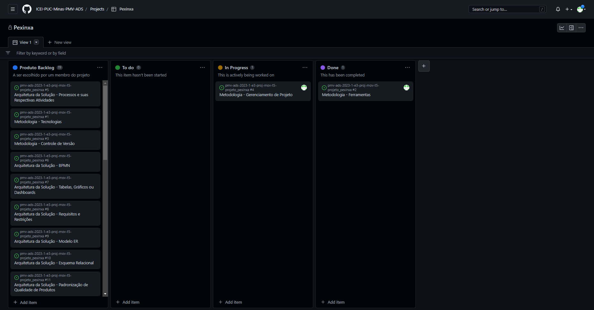

# Metodologia

Pré-requisitos: <a href="2-Especificação do Projeto.md"> Documentação de Especificação</a>

Descreva aqui a metodologia de trabalho do grupo para atacar o problema. Definições sobre os ambiente de trabalho utilizados pela  equipe para desenvolver o projeto. Abrange a relação de ambientes utilizados, a estrutura para gestão do código fonte, além da definição do processo e ferramenta através dos quais a equipe se organiza (Gestão de Times).

## Relação de Ambientes de Trabalho

Os artefatos do projeto são desenvolvidos a partir de diversas plataformas e a relação dos ambientes com seu respectivo propósito deverá ser apresentada em uma tabela que especifica que detalha Ambiente, Plataforma e Link de Acesso. 
Nota: Vide documento modelo do estudo de caso "Portal de Notícias" e defina também os ambientes e frameworks que serão utilizados no desenvolvimento de aplicações móveis.

## Controle de Versão

A ferramenta de controle de versão adotada no projeto foi o
[Git](https://git-scm.com/), sendo que o [Github](https://github.com)
foi utilizado para hospedagem do repositório.

O projeto segue a seguinte convenção para o nome de branches:

- `main`: versão estável já testada do software
- `unstable`: versão já testada do software, porém instável
- `testing`: versão em testes do software
- `dev`: versão de desenvolvimento do software

Quanto à gerência de issues, o projeto adota a seguinte convenção para
etiquetas:

- `documentation`: melhorias ou acréscimos à documentação
- `bug`: uma funcionalidade encontra-se com problemas
- `enhancement`: uma funcionalidade precisa ser melhorada
- `feature`: uma nova funcionalidade precisa ser introduzida

Discuta como a configuração do projeto foi feita na ferramenta de versionamento escolhida. Exponha como a gerência de tags, merges, commits e branchs é realizada. Discuta como a gerência de issues foi realizada.

> **Links Úteis**:
> - [Microfundamento: Gerência de Configuração](https://pucminas.instructure.com/courses/87878/)
> - [Tutorial GitHub](https://guides.github.com/activities/hello-world/)
> - [Git e Github](https://www.youtube.com/playlist?list=PLHz_AreHm4dm7ZULPAmadvNhH6vk9oNZA)
>  - [Comparando fluxos de trabalho](https://www.atlassian.com/br/git/tutorials/comparing-workflows)
> - [Understanding the GitHub flow](https://guides.github.com/introduction/flow/)
> - [The gitflow workflow - in less than 5 mins](https://www.youtube.com/watch?v=1SXpE08hvGs)

## Gerenciamento de Projeto

### Divisão de Papéis

Apresente a divisão de papéis entre os membros do grupo.

Exemplificação: A equipe utiliza metodologias ágeis, tendo escolhido o Scrum como base para definição do processo de desenvolvimento. A equipe está organizada da seguinte maneira:
- Scrum Master: Felipe Domingos;
- Product Owner: Rommel Carneiro;
- Equipe de Desenvolvimento: Pedro Penna, Pedro Ivo, Rodrigo Richard;
- Equipe de Design: Simone Nogueira.

> **Links Úteis**:
> - [11 Passos Essenciais para Implantar Scrum no seu Projeto](https://mindmaster.com.br/scrum-11-passos/)
> - [Scrum em 9 minutos](https://www.youtube.com/watch?v=XfvQWnRgxG0)
> - [Os papéis do Scrum e a verdade sobre cargos nessa técnica](https://www.atlassian.com/br/agile/scrum/roles)

### Processo

Para o acompanhamento e organização do projeto, a equipe de desenvolvimento realizou a criação de um 'BackLog' a partir das ferramentas oferecidas pelo Github, sendo possível realizar a distribuição das tarefas e visualizar os status de cada uma. 

- `Produto backlog`: todas as tarefas
- `To do`: tarefas a serem feitas
- `In progress`: tarefas que estão sendo feitas
- `Done`: tarefas já realizadas
 

### Ferramentas

As ferramentas empregadas no projeto são:

- Editor de código : Expo Dev
- Ferramentas de comunicação:  Microsoft Teams 
- Ferramentas de desenho de tela: LucidHart
- Versionamento do projeto: Git

O editor de código foi escolhido porque ele possui ampla acessiblidade e fácil manuseio de ferramentas. As ferramentas de comunicação foram selecionadas a partir da compatibilidade da equipe de desenvolvimento com a área de estudos. Para criar diagramas utilizamos essa ferramenta por melhor captar as necessidades da nossa solução.
Por fim, para o melhor versionamento do projeto foi escolhido a solução "Git", responsável pela melhor adaptação e realocação de projetos.

 
> **Possíveis Ferramentas que auxiliarão no gerenciamento**: 
> - [LucidHart](https://lucid.app/lucidchart/)
> - [Git](https://git-scm.com/)
