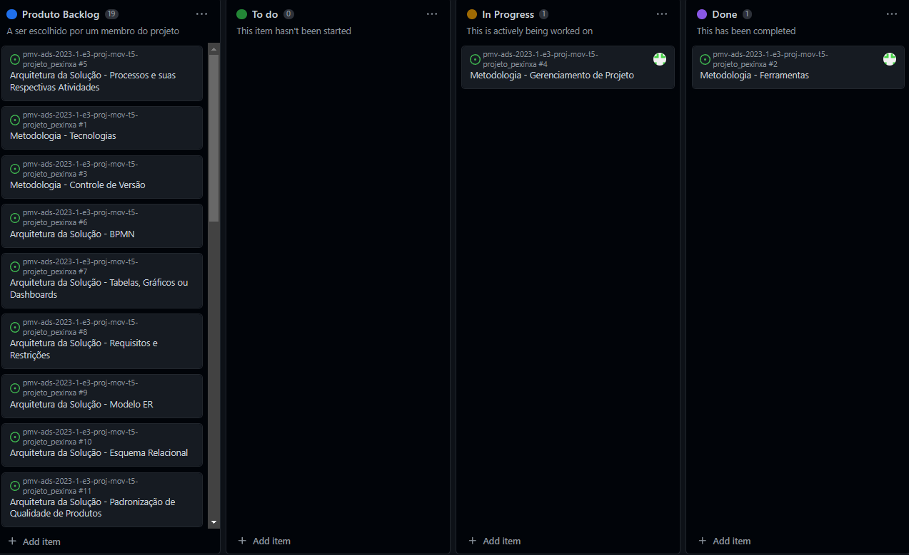

# Metodologia

Pré-requisitos: <a href="02-Especificação do Projeto.md"> Documentação de Especificação</a>

Metodologia de trabalho:
A equipe está usando a metodologia Agile para gerenciar o desenvolvimento do software. O Agile é uma abordagem iterativa e incremental para o desenvolvimento de software que enfatiza a colaboração entre a equipe, a entrega de software funcionando em intervalos regulares e a resposta às mudanças do projeto. A equipe está utilizando scrum.

Ambiente de trabalho:
A equipe está usando React Native para desenvolver o software. React Native é um framework para desenvolvimento de aplicativos móveis multiplataforma que permite o uso de JavaScript e React para criar aplicativos para iOS e Android. A equipe está usando um IDE específico para React Native, qual seja, o Visual Studio Code.

Processo de gestão de times:
A equipe também está usando o Git e o GitHub para controle de versão e distribuição de tarefas. O Git é um sistema de controle de versão distribuído que permite que várias pessoas trabalhem em um mesmo código fonte e registrem as alterações. O GitHub é uma plataforma baseada em nuvem para hospedar repositórios Git e gerenciar colaboração em projetos de software.
A equipe também está usando o Microsoft Teams para comunicação. O Microsoft Teams é uma plataforma de comunicação baseada em nuvem que permite que a equipe se comunique por chat, vídeo e chamadas de áudio. Ele também possui recursos de colaboração, como compartilhamento de arquivos e edição colaborativa.

## Controle de Versão

A ferramenta de controle de versão adotada no projeto foi o
[Git](https://git-scm.com/), sendo que o [Github](https://github.com)
foi utilizado para hospedagem do repositório.

O projeto segue a seguinte convenção para o nome de branches:

- `main`: versão estável já testada do software
- `unstable`: versão já testada do software, porém instável
- `testing`: versão em testes do software
- `dev`: versão de desenvolvimento do software

Quanto à gerência de issues, o projeto adota a seguinte convenção para
etiquetas:

- `documentation`: melhorias ou acréscimos à documentação
- `bug`: uma funcionalidade encontra-se com problemas
- `enhancement`: uma funcionalidade precisa ser melhorada
- `feature`: uma nova funcionalidade precisa ser introduzida

Discuta como a configuração do projeto foi feita na ferramenta de versionamento escolhida. Exponha como a gerência de tags, merges, commits e branchs é realizada. Discuta como a gerência de issues foi realizada.

> **Links Úteis**:
> - [Microfundamento: Gerência de Configuração](https://pucminas.instructure.com/courses/87878/)
> - [Tutorial GitHub](https://guides.github.com/activities/hello-world/)
> - [Git e Github](https://www.youtube.com/playlist?list=PLHz_AreHm4dm7ZULPAmadvNhH6vk9oNZA)
>  - [Comparando fluxos de trabalho](https://www.atlassian.com/br/git/tutorials/comparing-workflows)
> - [Understanding the GitHub flow](https://guides.github.com/introduction/flow/)
> - [The gitflow workflow - in less than 5 mins](https://www.youtube.com/watch?v=1SXpE08hvGs)

## Gerenciamento de Projeto

### Divisão de Papéis

A equipe utiliza a metodologia ágil "Scrum" para maior compreendimento do projeto e organização da equipe, sendo realizado a divisão de papéis entre os membros da equipe e reuniões diárias para a distribuição das tarefas.
- Scrum Master: Fernando Alves;
- Product Owner: Jhody Mike Possidonio Da Silva;
- Equipe de Desenvolvimento: Leticia Isabela Teodoro Campos, Eduardo Ramos da Silva, Alex Vinicius Dutra Berton;
- Equipe de Design: Erick Machado Reis
.

### Processo

Para o acompanhamento e organização do projeto, a equipe de desenvolvimento realizou a criação de um 'BackLog' a partir das ferramentas oferecidas pelo Github, sendo possível realizar a distribuição das tarefas e visualizar os status de cada uma. 

- `Produto backlog`: todas as tarefas
- `To do`: tarefas a serem feitas
- `In progress`: tarefas que estão sendo feitas
- `Done`: tarefas já realizadas
 

### Ferramentas

As ferramentas empregadas no projeto são:

- Editor de código : Expo Dev
- Ferramentas de comunicação:  Microsoft Teams 
- Ferramentas de desenho de tela: LucidHart
- Versionamento do projeto: Git

O editor de código foi escolhido porque ele possui ampla acessiblidade e fácil manuseio de ferramentas. As ferramentas de comunicação foram selecionadas a partir da compatibilidade da equipe de desenvolvimento com a área de estudos. Para criar diagramas utilizamos essa ferramenta por melhor captar as necessidades da nossa solução.
Por fim, para o melhor versionamento do projeto foi escolhido a solução "Git", responsável pela melhor adaptação e realocação de projetos.

 
> **Possíveis Ferramentas que auxiliarão no gerenciamento**: 
> - [LucidHart](https://lucid.app/lucidchart/)
> - [Git](https://git-scm.com/)
