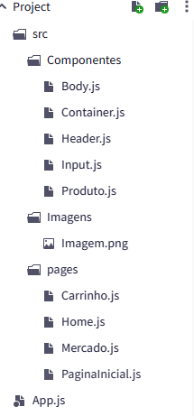
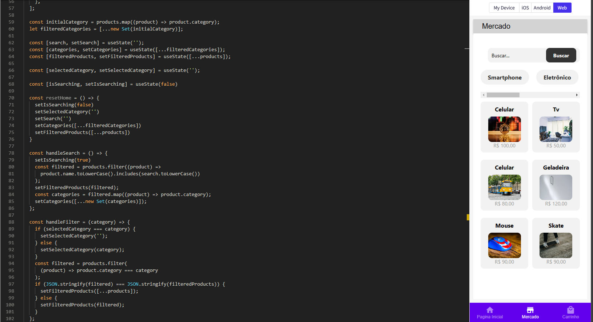
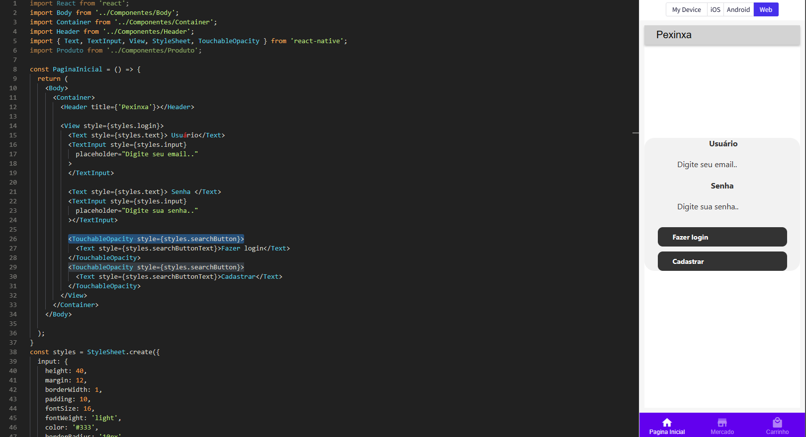
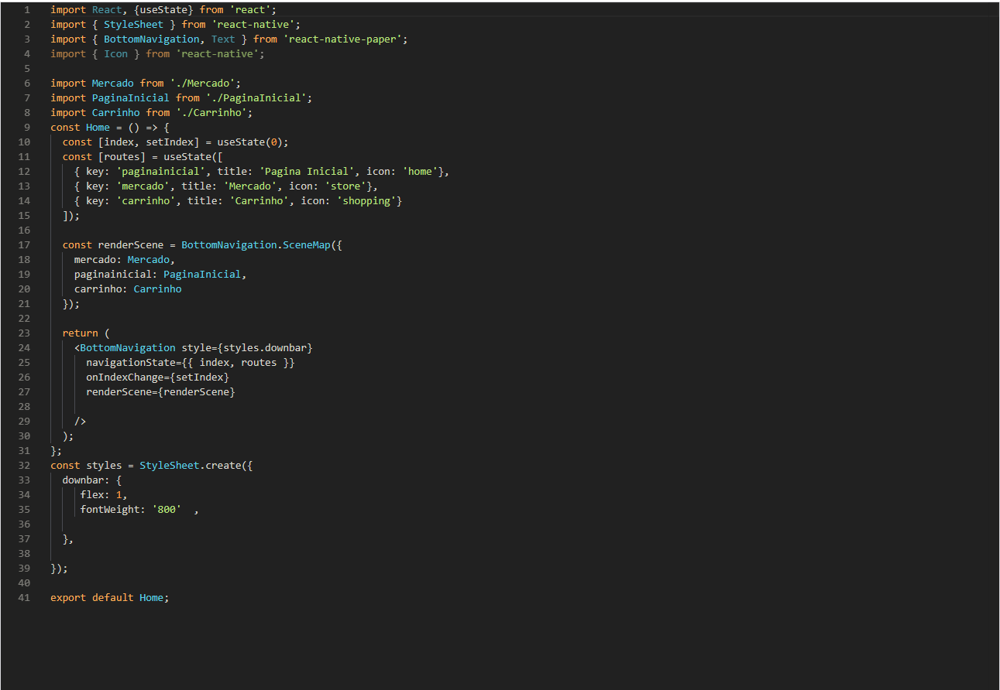
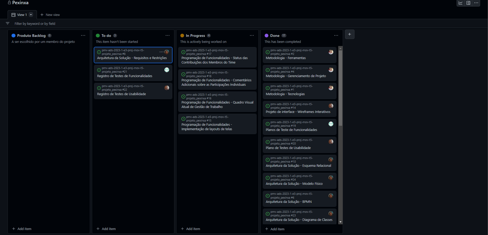

# Programação de Funcionalidades

"Retrato" do estado atual das implementações já feitas na aplicação, referenciando a requisitos funcionais/ não funcionais e usando como base a arquitetura de solução e wireframes já criados pela equipe.  Também foi inserido a representação do estado atual de contribuições de todo o time de desenvolvimento.

Link Expo Dev : https://snack.expo.dev/@eduardo7rr/app-pexinxa
### Organização do código (Eduardo , Fernando)
O código foi separado em componentes, muito útil para a reutilização de códigos e rápidez na codificação. 
 
Comentários do time de desenvolvimento ( Eduardo, Fernando ) : 
#### Eduardo : "Fiquei responsável pela criação de componentes para reutilização de código, além de facilitar a escrita e manutenibilidade do projeto. Ainda estou organizando todos os codigos em componentes.."
#### Fernando : "Também estou responsável pela criação de componentes para facilitar o desenvolvimento da aplicação.."

### Página de Produtos (Erick , Alex)
Implementação da página de produtos, com filtro de buscas e seletores de produtos para a facilidade do usuário ao pesquisar. 
- RF-04	A aplicação deve possuir um filtro para refinar a busca do usuário
- RF-01	A aplicação deve apresentar a funcionalidade de buscador (search)
- RF-02	A aplicação deve apresentar categorias de produtos para facilitar a busca dos usuários
- RNF-05	O sistema deve ser fácil de usar e entender 

Comentários do time de desenvolvimento ( Erick, Alex ) : 
  #### Erick : " Fiquei responsável pela implementação da funcionalidade de filtros e de pesquisa de produtos, o código ainda precisa de algumas alterações mas está quase finalizado" 
  #### Alex : " Fiquei responsável pela estilização dos componentes criados por erick, e por continuar a organização do código, essa base de estilo está sendo feita a partir da arquitetura de solução feita pela integrante da equipe: Leticia."
## Página de Login (Jhody)
Página para os usuários realizarem o login na aplicação, ou serem redirecionados para o cadastro. 
- RF-05	A aplicação deve possuir uma área de login para que o usuário possa fazer suas compras
- RF-07	A aplicação deve possuir uma área para cadastrar novos usuários e vendedores
 
Comentários do time de desenvolvimento ( Jhody ) : 
 #### Jhody Mike : "Fiquei responsável pela codificação da página de login e implementação das funcionalidades, o código ainda está em andamento.."

### Bottom Navigation  (Leticia)

Para maior acessibilidade e navegação na aplicação, foi implementado o 'BottomNavigation', que contém algumas das principais páginas que um usuário deve acessar. 
- RF-15	A aplicação deve possuir um sacola de compra
- RNF-05	O sistema deve ser fácil de usar e entender

 
Comentários do time de desenvolvimento ( Leticia  ) : 
 #### Leticia - "Fiquei responsável pela implementação da lógica do bottom navigation, além de estilizar a tela.."
## Backlog e Gestão de trabalho da equipe (Fernando)
 Cada tarefa, cada comentário e atribuição do time ao projeto, está sendo feito dentro do backlog da aplicação. Local onde a equipe se organiza e divide todas as tarefas a serem feitas ou que já foram concluídas. 
 Link para visualizar o quadro Backlog: https://github.com/orgs/ICEI-PUC-Minas-PMV-ADS/projects/249

Comentários do time de desenvolvimento ( Fernando ) : 
#### Fernando - "Fui responsável pela criação do backlog e organização da equipe de desenvolvimento, já utilizando o meu papel como 'scrum master'."
